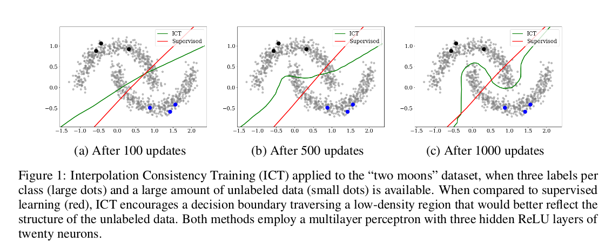
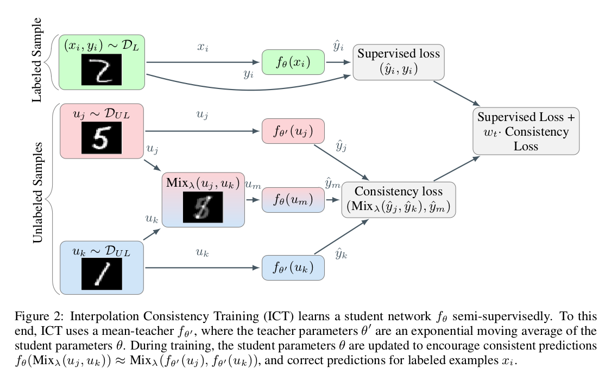

# Interpolation Consistency Training (ICT) for Deep Semi-supervised Learning 

This repo consists Pytorch code for the IJCAI 2019 paper *Intepolation Consistency Training for Semi-supervised Learning* (https://arxiv.org/abs/1903.03825)

In this paper, we propose a simple and efficient algorithm for training Deep Neural Networks in the Semi-supervised setting. We use interpolations between the unlabeled data samples as the perturbation directions for Consistency-regularization instead of random perturbations or adversarial perturbations. **Our method outperforms (or is competitive with) other recent state-of-the-art methods on CIFAR10 and SVHN datasets, despite having no significant additional computation cost**. 

<p align="center">
    
</p>

<p align="center">
    
</p>


If you find this work useful and use it on your own research, use the following bibtex to cite our [paper](https://arxiv.org/abs/1903.03825). 

```
@inproceedings{Verma:2019:ICT:3367471.3367546,
 author = {Verma, Vikas and Lamb, Alex and Kannala, Juho and Bengio, Yoshua and Lopez-Paz, David},
 title = {Interpolation Consistency Training for Semi-supervised Learning},
 booktitle = {Proceedings of the 28th International Joint Conference on Artificial Intelligence},
 series = {IJCAI'19},
 year = {2019},
 isbn = {978-0-9992411-4-1},
 location = {Macao, China},
 pages = {3635--3641},
 numpages = {7},
 url = {http://dl.acm.org/citation.cfm?id=3367471.3367546},
 acmid = {3367546},
 publisher = {AAAI Press},
} 


```


### Requirements
This code has been tested with  
python 3.6.8  
torch 1.0.0  
torchvision 0.2.1

### Data Preprocessing

The precomputed zca files are in data/cifar10/ . You can compute it yourself also by running the script python cifar10_zca.py. This will compute and save the ZCA for CIFAR10 in the folder data/cifar10/ 


### For reproducing results on Cifar10 with 4000 labeled data with CNN13 architechture
```
python main.py  --dataset cifar10  --num_labeled 400 --num_valid_samples 500 --root_dir experiments/ --data_dir data/cifar10/ --batch_size 100  --arch cnn13 --dropout 0.0 --mixup_consistency 100.0 --pseudo_label mean_teacher  --consistency_rampup_starts 0 --consistency_rampup_ends 100 --epochs 400  --lr_rampdown_epochs 450 --print_freq 200 --momentum 0.9 --lr 0.1 --ema_decay 0.999  --mixup_sup_alpha 1.0 --mixup_usup_alpha 1.0
```

### For reproducing results on SVHN with 1000 labeled data with CNN13 architechture
```
python main.py  --dataset svhn  --num_labeled 100 --num_valid_samples 100 --root_dir experiments/ --data_dir data/svhn/ --batch_size 100  --arch cnn13 --dropout 0.0 --mixup_consistency 100.0 --pseudo_label mean_teacher  --consistency_rampup_starts 0 --consistency_rampup_ends 100 --epochs 400  --lr_rampdown_epochs 450 --print_freq 200 --momentum 0.9 --lr 0.1 --ema_decay 0.999  --mixup_sup_alpha 0.1 --mixup_usup_alpha 0.1
```

Running above commands will create a experiment directory with an appropriate name in the directory experiments. For example:experiments/SSL_cifar10_labels_400_valids_500_archcnn13_do0.0_optsgd_lr_0.1_init_lr_0.0_ramp_up_0_ramp_dn_450_ema_d_0.999_m_consis_10.0_type_mse_ramp_0_100_l2_0.0001_eph_400_bs_100_m_sup_a1.0_m_usup_a1.0_pl_mean_teacher_job_id_ 

### Argument description
All the results of the paper can be reproduced by using the appropriate args in the above commands. Following are the args that should be varied to reproduce different experiments of the paper:

--dataset : cifar10 or svhn

--data_dir : data/cifar10 or data/svhn

--num_labeled : number of labeled samples *per class* ( 100/200/400 for cifar10, 25/50/100 for svhn)

--num_valid_samples : number of validation samples *per class* ( 500 for cifar10,  100 for svhn)

--arch : cnn13 or WRN28_2

--mixup_consistency : Max value of consistency coefficient ( check the best values for different experiments in the paper: Section "Experiments")

--consistency_rampup_ends : number of epochs at which the consistency coefficient reaches it maximum value. In all our experiments, this was set to one-fourth of total number of epochs.

--epochs : number of epochs 

--lr_rampdown_epochs: we use cosine ramp-down of learning rate. --lr_rampdown_epochs is the number of epochs at which the learning rate reaches a value of zero. This should be set approximantely 10% more than --epochs

--mixup_sup_alpha, --mixup_usup_alpha : alpha hyperparameter for mixing in supervised loss and consistency loss, respectively. We used same values for both to do minimal hyperparameter seach. Please see the best values for different experiments in the paper.


Disclaimer: Instead of providing a highly optimized code, the purpose of this repo is to provide a user with an easy to use code for reproducing the results in our paper and to use this work in their own research. This repo uses the code from Mean-Teacher repo : (https://github.com/CuriousAI/mean-teacher)
